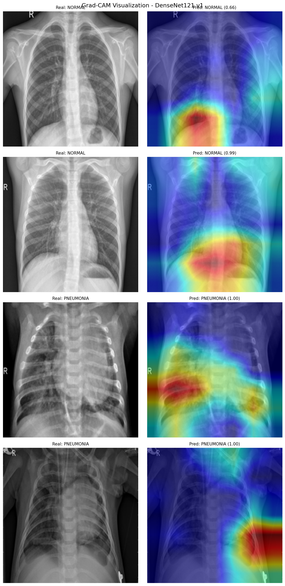

# Pneumonia Detection from Chest X-Rays

A dual-methodology diagnostic framework for pneumonia detection using chest X-ray images,
combining classical Machine Learning with Deep Learning.

## Overview

This project implements two independent pipelines to classify chest X-rays as either
**NORMAL** or **PNEUMONIA**:

- **ML Pipeline:** texture feature extraction using Local Binary Patterns (LBP) and
Gray-Level Co-occurrence Matrices (GLCM), fed into Random Forest and XGBoost classifiers.
SMOTE oversampling is applied to address class imbalance.

- **DL Pipeline:** DenseNet121 with Transfer Learning, trained in two phases
(feature extraction and fine-tuning). Grad-CAM heatmaps are generated to provide
visual interpretability of the model's decisions.

## Dataset

[Chest X-Ray Images (Pneumonia)](https://www.kaggle.com/datasets/paultimothymooney/chest-xray-pneumonia)
by Paul Mooney on Kaggle.

| Split | NORMAL | PNEUMONIA |
|-------|--------|-----------|
| Train | 1,342  | 3,876     |
| Val   | 8      | 8         |
| Test  | 234    | 390       |

## Results

| Model | Accuracy | NORMAL Recall | PNEUMONIA Recall |
|-------|----------|---------------|------------------|
| Random Forest | 76% | 0.38 | 0.99 |
| Random Forest + SMOTE | 79% | 0.47 | 0.98 |
| XGBoost | 75% | 0.36 | 0.99 |
| XGBoost + SMOTE | 77% | 0.42 | 0.97 |
| DenseNet121 v1 | **88%** | **0.74** | **0.97** |

## Grad-CAM Visualizations

The model correctly focuses on clinically relevant regions of the lung.



## Project Structure

```
pneumonia-detection/
├── 01-exploration.ipynb       # Dataset exploration and analysis
├── 02-ml_pipeline.ipynb       # ML pipeline: LBP + GLCM + RF/XGBoost + SMOTE
├── 03-dl_pipeline.ipynb       # DL pipeline: DenseNet121 + Grad-CAM
└── results/
    ├── ml_pipeline/           # Confusion matrices and feature importance
    └── dl_pipeline/           # Training curves, confusion matrices, Grad-CAM
```

## Author

Pedro Medina — [github.com/pedromedinatech](https://github.com/pedromedinatech)